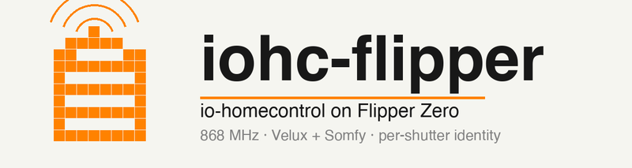
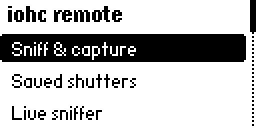
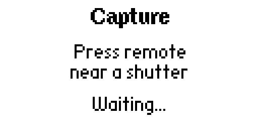

<p align="center">
  
</p>

# iohc-flipper

A Flipper Zero FAP that speaks **io-homecontrol** — the 868 MHz proprietary
RF protocol used by Velux, Somfy, and others for motorised shutters, blinds,
and windows. Sniff real remotes, learn their identities, and operate
multiple shutters from a single Flipper with **per-shutter identity
isolation** and **cross-vendor pairing** (Somfy + Velux validated on real
hardware).

Built as interop research on hardware I own, under EU 2009/24/EC.

---

## Status

| Phase | Capability | Status |
|---|---|---|
| 1 | 868 MHz passive sniffer (CC1101, FSK, sync trick) | ✅ |
| 2 | Frame parser (Ctrl B1/B2, dst/src, cmd, payload, seq, MAC, CRC-Kermit) | ✅ |
| 3 | Install-key recovery via cross-pair incident | ✅ |
| 4 | 1W TX (HMAC-signed, real-time bit-packing, UART wrap) | ✅ |
| 5 | Flipper as independent paired emitter (Somfy) | ✅ |
| 5.5 | Full UI (sniff/save/per-shutter/all-shutters/identity backup) | ✅ |
| 5.6 | Per-shutter identities (motor isolation by HMAC) | ✅ |
| 5.7 | Auto-mirror backup + JSON export for HA handover | ✅ |
| 6a | Vendor byte per device (auto-detected from sniff) | ✅ |
| 6b | **Velux pairing + control** | ✅ |
| 6c | Per-device `man_id` — fully vendor-agnostic TX | ✅ |
| 7 | Encrypted on-device storage | ❌ skipped (cleartext acceptable; Flipper is temporary) |
| 8 | Unleashed catalog submission | ⏳ |
| 9 | 2W support via SX1262 add-on | ⏳ |
| 10 | Home Assistant bridge (ESP32 / ESPHome / RPi) | ⏳ |

---

## What it does

| Main menu | Sniff & Capture | Live sniffer |
|---|---|---|
|  |  |  |

> *Screenshots of the Saved shutters list, per-device actions, and Identity
> view aren't included in the public repo — they show the project owner's
> installation's remote IDs and global install_key. Easy to reproduce on
> your own hardware once you sniff a remote.*

### Sniff & Capture

Press a button on any io-homecontrol remote near the Flipper. The app
indexes frames by source remote, auto-detects the vendor byte from button
frames (`0x43` Somfy, `0x61` Velux), and offers to save a named entry.

### Per-shutter identity isolation

Each saved shutter gets its own fresh `(src, install_key, seq)`. When you
press UP/DOWN/STOP for shutter A, only A's motor reacts — others ignore
the frame because the HMAC was signed with A's install_key. No more "blast
all shutters" surprises.

### Pairing

The Flipper can pair itself with a motor — no external programmer needed.
For Somfy: hold PROG on a real Smoove remote, then `Pair Flipper here`.
For Velux: hold gear on a real KLI 313 remote, then `Pair Flipper here`.

The pair sequence emits the full APPAIRAGE/PROG burst including the
STOP+DOWN follow-up required by Velux per KLI 313 manual page 10 step 5.

### Identity backup & export

Identity → Backup writes timestamped binary snapshots **and** a JSON export
ready for a future Home Assistant bridge to ingest. Every save also writes
an automatic `*.bak.bin` mirror.

JSON format:

```json
{
  "format": "iohc_flipper_export",
  "version": 1,
  "global_identity": { "src": "...", "install_key": "...", "seq": 142 },
  "devices": [
    { "name": "user-C", "motor_addr": "0001BF", "vendor": "0x43",
      "src": "67A315", "install_key": "...", "seq": 28 }
  ]
}
```

---

## Hardware

- **Flipper Zero** running [Unleashed firmware](https://github.com/DarkFlippers/unleashed-firmware)
  (SDK API 87.8, target 7).
- Internal CC1101 sub-GHz transceiver. The 868 MHz path is +14 dBm capable
  but real-world reliability depends on the motor's RSSI margin. If you
  need range, the SX1262 add-on (Phase 9) gets you ~10 dB.

---

## Build & install

```bash
# One-time
git clone https://github.com/<your-username>/iohc-flipper.git
cd iohc-flipper
python3 -m venv .venv && .venv/bin/pip install ufbt pyserial flipperzero-protobuf pillow

# Build + deploy + launch
cd iohc_flipper
../.venv/bin/ufbt launch
```

The FAP is also installable manually: copy `iohc_flipper/dist/iohc_flipper.fap`
to `/ext/apps/Sub-GHz/` on the Flipper SD card.

---

## Usage walkthrough

1. **Launch** the app (Apps → Sub-GHz → iohc_flipper).
2. **Sniff & Capture** → press a button on a real remote near the Flipper.
   You'll see one row per unique remote with its vendor byte detected.
   Press OK → name → save.
3. **Saved shutters** → pick your new entry → `Pair Flipper here`.
   - Somfy: hold PROG on the real Smoove remote first (~2 s).
   - Velux: hold gear on the real KLI 313 remote first (~2 s) — motor cycles open/close briefly.
4. Flipper sends the pair burst → green LED → motor adopts the Flipper's identity.
5. Now UP/DOWN/STOP from the saved entry move only that motor.

---

## Protocol notes (the interesting bits)

### Sync-encoding trick

The CC1101 hardware sync detector demodulates one byte too soon for raw
io-homecontrol bytes to align. By treating `SYNC1/SYNC0 = 0x57FD` as the
*preamble-tail + UART-wrapped 0xFF*, the chip locks on early and the wrap
of `0x33` (the next iohc byte) starts at the right bit. Sniff and TX both
work without a software bit-finder.

### CRC-16/KERMIT

Polynomial `0x8408` (reflected). Computed over `Ctrl B2` through the last
byte before the CRC itself. Same for Somfy and Velux.

### HMAC for 1W frames

AES-128-ECB with a constructed IV: `frame_data + running_checksum + seq + 0x55 padding`,
keyed by the emitter's install_key. The MAC slot is the last 6 bytes of the
1W suffix. Validated against captured frames from both vendors.

### Install key wrap (cmd 0x30 pair frame)

AES-CFB128 with the **public io-homecontrol transfer_key**:

```
0x34C3466ED88F4E8E16AA47394988 4373
```

IV is built from the emitter `src_addr` repeated 5× plus a trailing
`src_addr[0]`. Single-block CFB reduces to `output = install_key XOR AES_ECB(transfer_key, IV)`.
Output is 16 bytes — placed verbatim into the cmd 0x30 frame.

Same algorithm works for **both Somfy and Velux**. The vendor-specific
parts are elsewhere (see below).

### Vendor-specific bytes (the *only* per-vendor code paths)

| Field | Position | Somfy | Velux |
|---|---|---|---|
| Button frame `vendor` byte | cmd 0x00 payload[1] | `0x43` | `0x61` |
| Pair frame `manufacturer_id` | cmd 0x30 byte[25] | `0x02` | `0x01` |
| Pair frame `dst` | cmd 0x30 dst | broadcast `00 00 3F` | type-codes `00 00 BF` (window) / `00 00 FF` (shutter) / `00 03 7F` (other) |
| STOP+DOWN follow-up after rings | within 3 s | unused (harmless) | **required** |

Both `vendor` and `man_id` are stored **per device** as raw observed wire
bytes (`devices.bin` v3, since Phase 6c). The TX path reads them verbatim
— no vendor enums, no mapping function in the hot path. `vendor` comes
from a sniffed cmd 0x00 button frame; `man_id` from a sniffed cmd 0x30
pair frame, with a capture-time fallback (`iohc_man_id_default_for_vendor`)
deriving it from `vendor` when we haven't seen a pair frame on-air.

This matches the rspaargaren/iown-homecontrol-esp32sx1276 architecture
([iohcRemote1W.cpp:221](https://github.com/rspaargaren/iown-homecontrol-esp32sx1276/blob/master/src/iohcRemote1W.cpp))
— the canonical OSS approach.

### Privacy by HMAC, not by address

Velux NodeIDs (BF/FF/7F) are *product type codes*, not unique device IDs.
All windows in a neighborhood hear "REGLAGE to 0000BF" but only the one
paired with the emitter (matching install_key) verifies the HMAC. This
makes the same broadcast-only TX strategy work for Velux as for Somfy.

---

## Project layout

```
iohc-flipper/
├── iohc_flipper/             # The FAP
│   ├── application.fam
│   └── src/
│       ├── iohc_app.c        # App entry, view dispatcher, callback wiring
│       ├── radio/            # CC1101 driver (RX/TX, register init, calibration)
│       ├── phy/              # PHY layer (frame assembly from FIFO)
│       ├── iohc/             # Protocol: parse, build, CRC, HMAC, AES, key wrap
│       ├── state/            # Identity, device book, TX runner
│       ├── ui/               # Views: main menu, sniffer, capture, device list, identity
│       └── log/              # Per-session CSV/BIN log writer
├── tools/                    # Python helpers (CLI, screen, RPC)
├── docs/                     # Captures, backups, phase docs
├── refs/                     # Upstream RE projects (gitignored)
├── PROGRESS.md               # Full historical context (8000+ lines of context window)
├── BRIEF.md                  # Original project brief
├── SUMMARY.md                # Protocol summary
├── ROADMAP.md                # Long-term plan
├── CLAUDE.md                 # AI agent on-ramp
└── README.md                 # This file
```

---

## Roadmap

- ~~**Phase 7**: encrypted on-device storage~~ — **skipped**. Cleartext on
  SD is acceptable: the Flipper is a temporary stepping stone, physical SD
  access requires the device itself, and install_keys are recoverable from
  any captured pair frame regardless of disk encryption.
- **Phase 8**: Unleashed catalog submission — icon, screenshots, MIT-style
  license.
- **Phase 9**: SX1262 GPIO add-on for ~10 dB more link budget. Optional
  per-installation.
- **Phase 10**: Home Assistant bridge. The Flipper FAP is a stepping stone;
  long-term the protocol lives on HA (via ESPHome / ESP32 / RPi). The JSON
  export from Identity → Backup is the migration handover artifact. Seq
  counter migrates manually at handover (one-time form entry in HA).

See [ROADMAP.md](ROADMAP.md) for details.

---

## License

iohc-flipper is **dual-licensed** at your option under:

- the [MIT License](LICENSE) — for the original code in this repository
- the [Apache License, Version 2.0](LICENSE-APACHE) — for the portions
  derived from upstream Apache-2.0 sources (see [NOTICE](NOTICE))

Files containing derived code carry an `SPDX-License-Identifier: MIT OR
Apache-2.0` header. Everything else is MIT-only by default.

## Sources & credits

**Code reused (Apache 2.0 — proper attribution in [NOTICE](NOTICE))**

- [rspaargaren/iown-homecontrol-esp32sx1276](https://github.com/rspaargaren/iown-homecontrol-esp32sx1276)
  — `compute_checksum()` in our `hmac_1w.c` is a verbatim port of their
  `computeChecksum()`; `iohc_wrap_install_key()` in our `key_encrypt.c`
  is an algorithmic port of their `encrypt_1W_key()`; the public iohc
  `transfer_key` constant comes from line 47 of the same file.
- [rspaargaren/iown-home](https://github.com/rspaargaren/iown-home) —
  definitive cmd 0x30 frame structure (`enc_key[16] man_id ?? seq[2]`),
  documented in their `docs/commands.md`.

**Concept references (no code reused)**

- [Velocet/iown-homecontrol](https://github.com/Velocet/iown-homecontrol)
  (CC0) — io-homecontrol RE umbrella project. General protocol orientation
  and command-ID reference.
- [merbanan/rtl_433](https://github.com/merbanan/rtl_433) (GPL-2.0+) —
  conceptual reference for sub-GHz sync alignment when the hardware sync
  detector locks one byte early. Independent reimplementation for CC1101.

**Host firmware**

- [DarkFlippers/unleashed-firmware](https://github.com/DarkFlippers/unleashed-firmware)
  (GPL-3.0) — Flipper Zero firmware. iohc-flipper is a dynamically-loaded
  user app (FAP), treated by the Flipper community as a library-boundary
  separation that permits permissive licenses on FAPs.

**Manufacturer documentation**

- Velux KLI 310/311/312/313 user manual ([PDF](https://www.velux.co.nz/~/media/marketing/ca/fr/integra/454416-2018-08%20integra%20support%20ca-fre.pdf))
  — pages 4, 10, 15 — official pairing procedure (REGLAGE / APPAIRAGE
  buttons, STOP+DOWN follow-up).

**On-air captures**

- Smoove Origin IO (Somfy) and KLI 313 (Velux) remotes, on the project
  owner's own installation. Captured frames live in `docs/*.csv` (button
  frames only; install-key-bearing cmd 0x30 captures are excluded from
  the public branch).

---

## Disclaimer

This is interop research on hardware owned by the project owner. EU
Directive 2009/24/EC permits reverse engineering for interoperability.
**Do not use against equipment you don't own.** The protocol decisions
documented here were derived from on-air sniffs and public reverse-
engineering projects; nothing here is sourced from manufacturer NDA
material.
